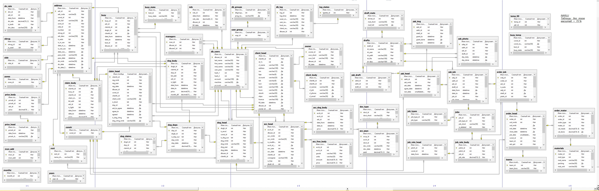

# SQL_Naruj
Some stored procedures & main daigram for Naruj department.

Take a look: 

Diagrams: 
<ul>
	<li><a href="Screenshots/main_diagram.jpg">main diagram</a>.</li>
</ul>

Stored procedures:
<ul>
	<li><a href="Procedures/add_claimb_recalc.sql">add_claimb_recalc.sql</a>,</li>
	<li><a href="Procedures/sp_acc_dog_upd.sql">sp_acc_dog_upd.sql</a>,</li>
	<li><a href="Procedures/sp_acc_free_upd.sql">sp_acc_free_upd.sql</a>,</li>
	<li><a href="Procedures/sp_acc_recalc.sql">sp_acc_recalc.sql</a>.</li>
	<li><a href="Procedures/sp_acch_new.sql">sp_acch_new.sql</a>.</li>
	<li><a href="Procedures/sp_claimb_upd.sql">sp_claimb_upd.sql</a>.</li>
	<li><a href="Procedures/sp_dog_recalc.sql">sp_dog_recalc.sql</a>.</li>
</ul>

Here is the main diagram:
 

